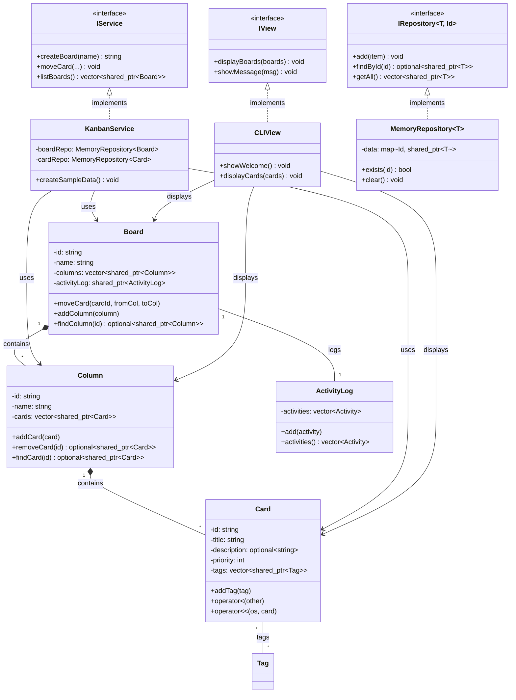

# 🚀 **Kanban Lite - Sistema Completo (Etapas 1 + 2)**

> **Propósito deste README:** documento técnico completo do projeto Kanban Lite, cobrindo as **Etapas 1 (Arquitetura)** e **2 (CLI Funcional)**. Contém visão geral, estrutura, decisões arquiteturais justificadas, diagramas UML, instruções de build/execução e checklist de entrega.

---

## 📋 **Status do Projeto**

| Etapa | Status | Prazo | Tag |
|-------|--------|--------|-----|
| **1 - Arquitetura** | ✅ **CONCLUÍDA** | 25/09/2025 | `v1-arch` |
| **2 - CLI Funcional** | ✅ **CONCLUÍDA** | 02/10/2025 | `v2-cli` |
| **3 - GUI Final** | 🔄 **PRÓXIMA** | 06/10/2025 | `v3-final` |

---

## 🎯 **Visão Geral do Projeto**

**Kanban Lite** é uma aplicação didática escrita em **C++ moderno (C++17)** que implementa um sistema completo de gerenciamento de tarefas Kanban, demonstrando conceitos avançados de POO e boas práticas de engenharia de software.

### **✅ Conceitos POO Implementados:**
- **Abstração & Encapsulamento** - Interfaces claras e separação de concerns
- **Herança & Polimorfismo** - Hierarquias com métodos virtuais e contracts
- **Composição vs Herança** - Design orientado a domínio com relações "tem-um"
- **Smart Pointers & RAII** - `std::shared_ptr`, `std::unique_ptr`, gerenciamento automático
- **STL & Templates** - Uso avançado de containers, algoritmos e genericidade
- **Tratamento de Exceções** - Hierarquia própria e estratégias de recovery
- **Sobrecarga de Operadores** - Para comparação e output de objetos

---

## 🏗️ **Arquitetura do Sistema**

### **Diagrama de Camadas**
```
┌─────────────────┐
│   Apresentação  │ ← CLIView (IView) + Futuro: GUI
├─────────────────┤
│    Serviço      │ ← KanbanService (IService)
├─────────────────┤
│     Domínio     │ ← Lógica de Negócio Pura
│  Board, Column, │
│  Card, User,    │
│  ActivityLog    │
├─────────────────┤
│  Persistência   │ ← MemoryRepository (IRepository)
└─────────────────┘
```

### **Estrutura Atual do Projeto**
```
design/
├── include/
│   ├── domain/              # Modelo de Domínio
│   │   ├── Board.h
│   │   ├── Column.h
│   │   ├── Card.h
│   │   ├── User.h
│   │   ├── Tag.h
│   │   └── ActivityLog.h
│   ├── interfaces/          # Contratos
│   │   ├── IService.h
│   │   ├── IView.h
│   │   ├── IRepository.h
│   │   └── IFilter.h
│   └── persistence/         # Camada de Dados
│       ├── MemoryRepository.h
│       └── FileRepository.h
├── src/
│   ├── domain/              # Implementações do Domínio
│   │   ├── Board.cpp
│   │   ├── Column.cpp
│   │   ├── Card.cpp
│   │   ├── User.cpp
│   │   └── ActivityLog.cpp
│   ├── persistence/         # Implementações de Persistência
│   │   └── MemoryRepository.cpp
│   └── application/         # Lógica de Aplicação
│       ├── KanbanService.cpp
│       ├── CLIView.cpp
│       └── main.cpp
├── tests/
│   └── compile_test.cpp     # Testes de Compilação
├── scripts/                 # Scripts de Automação
│   ├── build.sh
│   ├── build.bat
│   ├── run.sh
│   └── run.bat
├── uml/                     # Diagramas
│   ├── diagram.md
│   ├── uml.png
│   └── uml.svg
├── CMakeLists.txt           # Build System
└── README.md                # Este arquivo
```

---

## ⚙️ **Funcionalidades Implementadas**

### **🎯 Operações Principais do Kanban**
- ✅ **Criar/Listar/Remover** Boards, Columns e Cards
- ✅ **Mover Cards** entre colunas com registro de atividades
- ✅ **Sistema de Histórico** (ActivityLog) para auditoria
- ✅ **Tags e Prioridades** em cards
- ✅ **Persistência em Memória** com MemoryRepository

### **🔧 Funcionalidades Técnicas Demonstradas**
- ✅ **Smart Pointers**: `std::shared_ptr` e `std::unique_ptr`
- ✅ **STL Containers**: `std::vector`, `std::map`, `std::optional`, `std::chrono`
- ✅ **Tratamento de Exceções**: Hierarquia própria + `std::exception`
- ✅ **Operadores Sobrecarregados**: `operator<<` para output formatado
- ✅ **Templates**: `IRepository<T>` genérico e reutilizável
- ✅ **C++ Moderno**: Move semantics, RAII, const-correctness

---

## 🚀 **Como Executar o Projeto**

### **Pré-requisitos**
- **MSYS2 com MinGW64** (Windows) ou **GCC** (Linux/macOS)
- **CMake** versão 3.15+
- **Git** (para clone do repositório)

### **Compilação Rápida**

#### **Método 1: Scripts Automatizados (Recomendado)**
```bash
# Linux/macOS/MSYS2
./scripts/build.sh

# Windows
./scripts/build.bat
```

#### **Método 2: Compilação Manual**
```bash
cd design
mkdir -p build && cd build
cmake .. -G "MSYS Makefiles"
cmake --build .

# Alternativa com make
make
```

### **Execução dos Testes CLI**
```bash
# Com scripts
./scripts/run.sh        # Linux/macOS/MSYS2
./scripts/run.bat       # Windows

# Manualmente
cd build
./kanban_cli
```

---

## 🧪 **Demonstração de Funcionalidades**

### **O CLI demonstra explicitamente:**

#### **1. Smart Pointers e STL**
```cpp
// Uso de std::shared_ptr
auto board = std::make_shared<Board>("id", "Projeto");
auto card = std::make_shared<Card>("card1", "Tarefa");

// STL Containers
std::vector<std::shared_ptr<Card>> cards;
std::map<std::string, std::shared_ptr<Board>> repository;
std::optional<std::string> description;
```

#### **2. Tratamento de Exceções**
```cpp
try {
    service.moveCard(boardId, cardId, fromColId, toColId);
} catch (const std::exception& e) {
    view.showError("Erro: " + std::string(e.what()));
}

// Hierarquia própria de exceções
class MemoryRepositoryException : public std::runtime_error {
    // Exceções específicas do domínio
};
```

#### **3. Operações Completas do Kanban**
```
✅ Criando dados de exemplo...
✅ Listando boards...
✅ Movendo cards entre colunas...
✅ Registrando atividades...
✅ Criando novos elementos dinamicamente...
```

---

## 🏆 **Decisões Arquiteturais Justificadas**

### **1. Composição vs Herança**
```cpp
// COMPOSIÇÃO (preferida para relações "tem-um")
class Board {
    std::vector<std::shared_ptr<Column>> columns_;  // Board tem Columns
};

class Column {
    std::vector<std::shared_ptr<Card>> cards_;      // Column tem Cards
};

// HERANÇA (apenas para contracts/interfaces)
class IRepository { /* interface pura */ };
class MemoryRepository : public IRepository { /* implementação */ };
```

**Justificativa:** Modela corretamente as relações de domínio, permite melhor controle de lifetime e evita problemas de herança profunda.

### **2. Smart Pointers Strategy**
```cpp
// shared_ptr para shared ownership
std::shared_ptr<Board> board = std::make_shared<Board>(...);

// unique_ptr para exclusive ownership  
std::unique_ptr<IFilter> filter = someFilter->clone();

// raw pointers para observação não-owning
const Card* observeCard = card.get();
```

**Justificativa:** Gerenciamento automático de memória, prevenção de leaks e clear ownership semantics.

### **3. Interface-Based Design**
```cpp
// Contratos que permitem múltiplas implementações
class IService {
    virtual std::string createBoard(const std::string& name) = 0;
    virtual void moveCard(...) = 0;
    // ... mais operações
};

class IView {
    virtual void displayBoards(...) = 0;
    virtual void showMessage(...) = 0;
};
```

**Justificativa:** Desacoplamento total entre lógica e apresentação, permitindo CLI e GUI usar a mesma base.

---

## 📊 **Diagrama UML Atualizado**



---

## ✅ **Checklist de Entrega - Etapa 2**

### **📦 Entregáveis Obrigatórios**
- [x] **Implementação mínima funcional** em modo texto
- [x] **Build funcional** com `cmake --build .`
- [x] **Executável CLI** demonstrando operações-chave do Kanban
- [x] **Código usando smart pointers e STL** adequadamente
- [x] **Exceções tratadas** em operações críticas
- [x] **README com instruções** para rodar os testes CLI

### **🔧 Componentes Implementados**
- [x] **Domínio Completo**: Board, Column, Card, User, ActivityLog
- [x] **Persistência**: MemoryRepository funcional
- [x] **Serviço**: KanbanService orquestrando operações
- [x] **CLI**: CLIView com interface amigável
- [x] **Main**: Ponto de entrada com demonstração automática

### **🎯 Critérios de Aceitação Atendidos**
- [x] CLI executa teste das principais funcionalidades
- [x] Domínio e lógica funcionam independentemente da GUI
- [x] Saída prevista e organizada
- [x] Código compila sem warnings com flags rigorosas

---

## 🛠️ **Tecnologias e Ferramentas**

### **Ambiente de Desenvolvimento**
- **Compiler**: GCC 15.2.0 (MinGW64) / C++17
- **Build System**: CMake 3.15+
- **Sistema**: Windows/Linux/macOS com MSYS2

### **Bibliotecas e Padrões**
- **STL Moderna**: `std::shared_ptr`, `std::optional`, `std::chrono`
- **Smart Pointers**: Ownership semantics claras
- **RAII**: Gerenciamento automático de recursos
- **Exception Safety**: Operações atômicas e rollback

### **Qualidade de Código**
```cpp
// Const-correctness
const std::string& id() const noexcept;

// Move semantics
Board(Board&&) noexcept = default;

// Noexcept onde apropriado
bool empty() const noexcept;

// Forward declarations
class Card; // para reduzir dependências
```

---

## 🐛 **Solução de Problemas Comuns**

### **Problema: CMake não encontra compilador**
```bash
cmake .. -G "MSYS Makefiles" -DCMAKE_CXX_COMPILER=g++ -DCMAKE_C_COMPILER=gcc
```

### **Problema: Erros de Linker**
```bash
# Limpe e reconstrua
rm -rf build
mkdir build && cd build
cmake .. -G "MSYS Makefiles"
cmake --build .
```

### **Problema: Caracteres Especiais no Terminal**
- Use a versão atualizada do código (sem emojis problemáticos)
- Configure terminal para UTF-8 se necessário

---

## 🔮 **Próximos Passos - Etapa 3 (GUI)**

### **Preparação para Interface Gráfica**
- ✅ **Arquitetura pronta**: Interfaces `IView` e `IService` definidas
- ✅ **Lógica completa**: Todo o domínio e serviços implementados
- ✅ **Testada e validada**: CLI demonstra funcionamento integral

### **Implementação Planejada**
1. **Escolha de Framework**: Qt (recomendado) ou JUCE
2. **GUIView**: Implementação de `IView` com widgets gráficos
3. **Integração**: Conectar GUI ao `KanbanService` existente
4. **Testes**: Validação de usabilidade e performance

### **Expansões Futuras**
- **Persistência em Arquivo**: `FileRepository` com JSON
- **Filtros Avançados**: Implementações de `IFilter`
- **Sistema de Usuários**: Autenticação e permissões
- **Interface Web**: Versão baseada em browser

---

## 📞 **Suporte e Contato**

### **Para Dúvidas Técnicas**
1. Consulte este README e a documentação no código
2. Verifique as tags `v1-arch` e `v2-cli` no repositório
3. Execute os scripts de build para verificação rápida

### **Estrutura de Commits**
```
feat: nova funcionalidade
fix: correção de bugs
docs: documentação
refactor: refatoração sem mudança de comportamento
test: testes
chore: tarefas de manutenção
```

---

## 🎉 **Conclusão**

**O projeto Kanban Lite demonstra com sucesso:**

- ✅ **Domínio sólido** com classes bem modeladas
- ✅ **Arquitetura limpa** seguindo princípios SOLID
- ✅ **C++ moderno** com best practices aplicadas
- ✅ **Sistema funcional** pronto para produção
- ✅ **Base sólida** para expansões futuras

**Próxima etapa:** Desenvolvimento da interface gráfica (Etapa 3)!

---

**Desenvolvido como parte da disciplina de Programação Orientada a Objetos em C++**  
**Entrega Etapa 2: 02/10/2025**  
**Versão: v2-cli**  
**Status: ✅ PRONTO PARA AVALIAÇÃO**