```mermaid

classDiagram

%% ======= Domain (Modelo de Domínio) =======

class Activity {

-string id_

-string description_

-TimePoint when_

+Activity(id, description, when)

+id() string

+description() string

+when() TimePoint

+operator<<(ostream, Activity) ostream

}

  

class ActivityLog {

-vector~Activity~ activities_

+add(Activity act) void

+activities() vector~Activity~

+size() size_t

+empty() bool

+last() const Activity*

+clear() void

}

  

class Board {

-string id_

-string name_

-vector~shared_ptr~Column~~ columns_

-shared_ptr~ActivityLog~ activityLog_

+Board(id, name)

+id() string

+name() string

+setName(name) void

+addColumn(shared_ptr~Column~) void

+removeColumnById(columnId) optional~shared_ptr~Column~~

+columns() vector~shared_ptr~Column~~

+findColumn(columnId) optional~shared_ptr~Column~~

+columnCount() size_t

+moveCard(cardId, fromColumnId, toColumnId) void

+setActivityLog(shared_ptr~ActivityLog~) void

+activityLog() shared_ptr~ActivityLog~

+hasColumn(columnId) bool

+clear() void

+setColumns(columns) void

}

  

class Column {

-string id_

-string name_

-vector~shared_ptr~Card~~ cards_

+Column(id, name)

+id() string

+name() string

+setName(name) void

+addCard(shared_ptr~Card~) void

+insertCardAt(index, shared_ptr~Card~) void

+removeCardById(cardId) optional~shared_ptr~Card~~

+cards() vector~shared_ptr~Card~~

+findCard(cardId) optional~shared_ptr~Card~~

+size() size_t

+empty() bool

+hasCard(cardId) bool

+clear() void

+moveCardToPosition(cardId, newIndex) bool

}

  

class Card {

-string id_

-string title_

-optional~string~ description_

-int priority_

-TimePoint createdAt_

-TimePoint updatedAt_

-vector~shared_ptr~Tag~~ tags_

+Card(id, title)

+id() string

+title() string

+setTitle(title) void

+description() optional~string~

+setDescription(desc) void

+priority() int

+setPriority(p) void

+createdAt() TimePoint

+updatedAt() TimePoint

+addTag(shared_ptr~Tag~) void

+removeTagById(tagId) bool

+hasTag(tagId) bool

+clearTags() void

+tags() vector~shared_ptr~Tag~~

+operator==(other) bool

+operator<(other) bool

+touchUpdated() void

+operator<<(ostream, Card) ostream

}

  

class Tag {

-string id_

-string name_

+Tag(id, name)

+id() string

+name() string

+setName(name) void

+operator<<(ostream, Tag) ostream

}

  

class User {

-string id_

-string name_

+User(id, name)

+id() string

+name() string

+setName(name) void

+operator==(other) bool

+operator!=(other) bool

+operator<<(ostream, User) ostream

}

  

%% ======= Interfaces (Camada de Abstração) =======

class IFilter {

<<interface>>

+~IFilter()

+matches(const Card& card) bool

+clone() unique_ptr~IFilter~

}

  

class IRepository~T, Id~ {

<<interface>>

+~IRepository()

+add(shared_ptr~T~) void

+remove(Id) void

+getAll() vector~shared_ptr~T~~

+findById(Id) optional~shared_ptr~T~~

}

  

class IService {

<<interface>>

+~IService()

+createSampleData() void

+createBoard(name) string

+addColumn(boardId, columnName) string

+addCard(boardId, columnId, title) string

+moveCard(boardId, cardId, fromColumnId, toColumnId) void

+listBoards() vector~shared_ptr~Board~~

+findBoard(boardId) optional~shared_ptr~Board~~

+listColumns(boardId) vector~shared_ptr~Column~~

+listCards(columnId) vector~shared_ptr~Card~~

+moveColumn(boardId, fromColumnId, toColumnId) void

+moveCardWithinColumn(boardId, columnId, cardId, newIndex) void

+getAllTags(boardId) vector~shared_ptr~Tag~~

+updateCardTags(boardId, cardId, tags) void

}

  

class IView {

<<interface>>

+~IView()

+showMessage(msg) void

+showError(msg) void

+displayBoards(vector~shared_ptr~Board~~) void

+displayColumns(vector~shared_ptr~Column~~) void

+displayCards(vector~shared_ptr~Card~~) void

}

  

%% ======= Persistence (Camada de Persistência) =======

class MemoryRepository~T, Id~ {

-map~Id, shared_ptr~T~~ data_

+MemoryRepository()

+~MemoryRepository()

+add(shared_ptr~T~) void

+remove(Id) void

+getAll() vector~shared_ptr~T~~

+findById(Id) optional~shared_ptr~T~~

+clear() void

+size() size_t

+exists(Id) bool

}

  

class FileRepository~T, Id~ {

-string path_

+FileRepository(path)

+~FileRepository()

+add(shared_ptr~T~) void

+remove(Id) void

+getAll() vector~shared_ptr~T~~

+findById(Id) optional~shared_ptr~T~~

}

  

%% ======= Application (Camada de Aplicação) =======

class KanbanService {

-MemoryRepository~Board~ boardRepository_

-MemoryRepository~Column~ columnRepository_

-MemoryRepository~Card~ cardRepository_

-MemoryRepository~User~ userRepository_

-int nextBoardId_

-int nextColumnId_

-int nextCardId_

-int nextUserId_

+KanbanService()

+~KanbanService()

+createSampleData() void

+createBoard(name) string

+addColumn(boardId, columnName) string

+addCard(boardId, columnId, title) string

+moveCard(boardId, cardId, fromColumnId, toColumnId) void

+listBoards() vector~shared_ptr~Board~~

+findBoard(boardId) optional~shared_ptr~Board~~

+listColumns(boardId) vector~shared_ptr~Column~~

+listCards(columnId) vector~shared_ptr~Card~~

+moveColumn(boardId, fromColumnId, toColumnId) void

+moveCardWithinColumn(boardId, columnId, cardId, newIndex) void

+getAllTags(boardId) vector~shared_ptr~Tag~~

+updateCardTags(boardId, cardId, tags) void

-generateBoardId() string

-generateColumnId() string

-generateCardId() string

-generateUserId() string

-validateBoardExists(boardId) void

-validateColumnExists(columnId) void

}

  

class CLIView {

+CLIView()

+~CLIView()

+showMessage(msg) void

+showError(msg) void

+displayBoards(boards) void

+displayColumns(columns) void

+displayCards(cards) void

+showWelcome() void

+showDemoHeader() void

+showDemoFooter() void

}

  

class CLIController {

-KanbanService& service_

-CLIView& view_

+CLIController(service, view)

+run() void

-handleCreateBoard(args) void

-handleMoveCard(args) void

-handleListBoards() void

-showHelp() void

}

  

%% ======= GUI (Interface Gráfica) =======

class MainWindow {

-unique_ptr~KanbanService~ service_

-QTabWidget* boardsTabWidget_

-QListWidget* boardsListWidget_

-QGroupBox* filterGroup_

-QComboBox* tagFilterCombo_

-QCheckBox* highPriorityFilter_

-QCheckBox* mediumPriorityFilter_

-QCheckBox* lowPriorityFilter_

-map~string, map~string, ColumnWidget*~~ columnWidgetsByBoard_

-string currentBoardId_

+MainWindow(parent)

+~MainWindow()

-setupUI() void

-setupConnections() void

-setupFilterPanel() void

-applyFilters() void

-clearFilters() void

-cardMatchesFilter(card) bool

-refreshFilterTags() void

}

  

class ColumnWidget {

-shared_ptr~Column~ column_

-QVBoxLayout* mainLayout_

-QVBoxLayout* cardsLayout_

-QScrollArea* scrollArea_

-bool dragOver_

-int dropIndicatorIndex_

+ColumnWidget(column, parent)

+getColumnId() string

+refreshCards(predicate) void

+cardWidgets() vector~CardWidget*~

+addNewCard() void

..signals..

+cardMoved(cardId, fromColumnId, toColumnId)

+cardAdded(columnId, title)

+cardReordered(columnId, cardId, newIndex)

+columnMoved(fromColumnId, toColumnId)

}

  

class CardWidget {

-shared_ptr~Card~ card_

-QLabel* titleLabel_

-QLabel* descriptionLabel_

-QLabel* priorityLabel_

-QHBoxLayout* tagsLayout_

+CardWidget(card, parent)

+getCardId() string

+getCard() shared_ptr~Card~

+applyFilter(visible) void

-updateTagsDisplay() void

..signals..

+moveUpRequested(cardId)

+moveDownRequested(cardId)

}

  

class CardDialog {

-shared_ptr~Card~ card_

-QLineEdit* titleEdit_

-QTextEdit* descriptionEdit_

-QComboBox* priorityCombo_

-QListWidget* tagsListWidget_

-QComboBox* tagsComboBox_

+CardDialog(card, parent)

+getTitle() QString

+getDescription() QString

+getPriority() int

+getTags() QStringList

-addTag() void

-removeTag() void

}

  

%% ======= Relações de Composição/Agregação =======

ActivityLog "1" *-- "0..*" Activity : contém

Board "1" *-- "0..*" Column : contém

Column "1" *-- "0..*" Card : contém

Card "1" *-- "0..*" Tag : possui tags

Board "1" --> "0..1" ActivityLog : registra atividades

  

MainWindow "1" *-- "1" KanbanService : usa

MainWindow "1" *-- "0..*" ColumnWidget : contém

ColumnWidget "1" *-- "0..*" CardWidget : contém

  

%% ======= Relações de Herança/Implementação =======

IRepository~T,Id~ <|.. MemoryRepository~T,Id~ : implementa

IRepository~T,Id~ <|.. FileRepository~T,Id~ : implementa

IService <|.. KanbanService : implementa

IView <|.. CLIView : implementa

  

QDialog <|-- CardDialog

QWidget <|-- CardWidget

QFrame <|-- ColumnWidget

QMainWindow <|-- MainWindow

  

%% ======= Relações de Dependência/Uso =======

KanbanService ..> IRepository~T,Id~ : usa repositórios

KanbanService ..> Board : manipula

KanbanService ..> Column : manipula

KanbanService ..> Card : manipula

KanbanService ..> User : manipula

KanbanService ..> Tag : manipula

  

CLIView ..> Board : exibe

CLIView ..> Column : exibe

CLIView ..> Card : exibe

  

CLIController ..> KanbanService : controla

CLIController ..> CLIView : controla

  

IFilter ..> Card : filtra

  

MainWindow ..> ColumnWidget : gerencia

MainWindow ..> KanbanService : usa serviço

ColumnWidget ..> CardWidget : contém

CardWidget ..> Card : exibe

CardDialog ..> Card : edita

  

%% ======= Especializações de Repositório =======

MemoryRepository~Board~ ..|> Board : persiste

MemoryRepository~Column~ ..|> Column : persiste

MemoryRepository~Card~ ..|> Card : persiste

MemoryRepository~User~ ..|> User : persiste

MemoryRepository~Tag~ ..|> Tag : persiste

```

# Relatório Técnico - Sistema Kanban Lite v3.0

  

## 1. Visão Detalhada do Projeto

  

### 1.1. Introdução

O **Sistema Kanban Lite** é uma aplicação completa desenvolvida em C++ moderno que implementa os princípios do método Kanban para gerenciamento de tarefas colaborativas. O projeto demonstra a aplicação prática dos conceitos de Programação Orientada a Objetos (POO) em C++, utilizando boas práticas modernas da linguagem e uma arquitetura bem definida em camadas.

  

### 1.2. Arquitetura do Sistema

O sistema foi estruturado em camadas bem definidas, seguindo os princípios de separação de concerns:

  

-  **Camada de Domínio**: Contém as entidades fundamentais do sistema (Board, Column, Card, User, ActivityLog, Tag) com suas regras de negócio e relacionamentos.

-  **Camada de Aplicação**: Implementa a lógica de aplicação através do KanbanService, que orquestra as operações e coordena as interações entre domínio, persistência e apresentação.

-  **Camada de Persistência**: Oferece abstrações para armazenamento de dados através da interface IRepository, com implementações concretas em memória (MemoryRepository) e arquivo (FileRepository).

-  **Camada de Apresentação**: Inclui tanto a interface gráfica (GUI) com Qt quanto a interface de linha de comando (CLI).

  

### 1.3. Principais Funcionalidades Implementadas

- ✅ Criação e gerenciamento de múltiplos quadros (boards) Kanban

- ✅ Criação de colunas personalizadas dentro de cada quadro

- ✅ Criação de cards (tarefas) com título, descrição, prioridade e tags

- ✅ Movimentação de cards entre colunas via drag & drop (GUI) ou comandos (CLI)

- ✅ Reordenação de cards dentro da mesma coluna

- ✅ Sistema de filtros avançados por tags e prioridades

- ✅ Histórico completo de atividades (ActivityLog) para auditoria

- ✅ Estatísticas de uso em tempo real

- ✅ Interface moderna com tema escuro e responsiva

  

### 1.4. Tecnologias e Ferramentas

-  **Linguagem**: C++17 (moderno com smart pointers, STL, templates)

-  **Biblioteca Gráfica**: Qt6 para a interface de usuário

-  **Sistema de Build**: CMake para build multiplataforma

-  **Controle de Versão**: Git com GitHub

-  **Sistemas Suportados**: Linux e Windows

  

## 2. Diagrama de Classes Atualizado

  



  

# Detalhamento Completo dos Requisitos POO e Implementação

  

## 3.1. Abstração & Encapsulamento

  

### Interfaces claras (.h/.cpp) - **Implementação Detalhada:**

  

**Exemplo em `Card.h`:**

```cpp

/**

* @brief Representa um cartão (task) no sistema Kanban

* @details Um Card representa uma tarefa individual no sistema Kanban,

* contendo título, descrição, prioridade, tags e metadados

* temporais para rastreamento de criação e modificação.

*/

class Card {

public:

// Interface pública bem definida

explicit Card(const std::string& id,  const std::string& title);

const std::string& id() const  noexcept;

const std::string& title() const  noexcept;

void setTitle(const std::string& title);

// ... outros métodos públicos

private:

// Implementação escondida

std::string id_;

std::string title_;

std::optional<std::string> description_;

// ... outros campos privados

};

```

  

**Separação interface/implementação:**

-  **`Card.h`**: Apenas declarações, documentação Doxygen

-  **`Card.cpp`**: Implementação completa com algoritmos STL

```cpp

// Card.cpp - Implementação separada

void Card::setTitle(const std::string& title) {

title_ = title;

touchUpdated(); // Atualização automática de timestamp

}

```

  

### Campos privados, getters/setters - **Exemplos Concretos:**

  

**Em `Card.h`:**

```cpp

private:

std::string id_; // Privado - acesso controlado

std::string title_; // Privado

std::optional<std::string> description_; // Privado - opcional

int priority_ =  0; // Privado com valor padrão

TimePoint createdAt_; // Privado - imutável

TimePoint updatedAt_; // Privado - atualizado automaticamente

  

public:

// Getters de apenas leitura

const std::string& id() const  noexcept { return id_; }

const std::string& title() const  noexcept { return title_; }

const std::optional<std::string>& description() const  noexcept { return description_; }

// Setters com lógica de negócio

void setTitle(const std::string& title);

void setDescription(const std::string& desc);

void setPriority(int p) noexcept;

```

  

**Em `Board.h` - acesso controlado a coleções:**

```cpp

private:

std::vector<std::shared_ptr<Column>> columns_; // Privado

  

public:

// Acesso controlado - retorna referência constante

const std::vector<std::shared_ptr<Column>>& columns() const  noexcept {

return columns_;

}

// Não fornece setter direto - apenas operações controladas

void addColumn(const std::shared_ptr<Column>& column);

std::optional<std::shared_ptr<Column>> removeColumnById(const Id& columnId);

```

  

**Validações em setters - `Card::setPriority()`:**

```cpp

void Card::setPriority(int p) noexcept {

priority_ = p; // Poderia ter validação: if (p >= 0 && p <= 5)

touchUpdated(); // Atualização automática do timestamp

}

```

  

## 3.2. Classes e Objetos

  

### Projeto com classes coerentes - **Arquitetura em Camadas:**

  

**Modelo-domínio (Entidades de Negócio):**

```cpp

// Core business entities

domain::Board // Quadro Kanban - agrega colunas

domain::Column // Coluna dentro de um board - agrega cards

domain::Card // Tarefa individual - possui tags, prioridade

domain::User // Usuário do sistema

domain::ActivityLog // Histórico de atividades

domain::Tag // Etiqueta para categorização

```

  

**Controllers (Lógica de Aplicação):**

```cpp

application::KanbanService // Orquestra operações, regras de negócio

application::CLIController // Controla fluxo da CLI

```

  

**Views (Apresentação):**

```cpp

application::CLIView // Renderização em terminal

gui::MainWindow // Interface gráfica principal

gui::ColumnWidget // Widget de coluna na GUI

gui::CardWidget // Widget de card na GUI

```

  

### Relações e responsabilidades bem definidas - **Exemplos Específicos:**

  

**`Board` - Responsabilidade única:**

```cpp

class Board {

// Responsabilidade: Gerenciar colunas e coordenação entre elas

void moveCard(const std::string& cardId,  const Id& fromColumnId,  const Id& toColumnId);

void addColumn(const std::shared_ptr<Column>& column);

// Não gerencia diretamente cards - delega para Column

};

```

  

**`KanbanService` - Orquestração:**

```cpp

class KanbanService {

// Responsabilidade: Coordenar operações complexas entre entidades

std::string addCard(const std::string& boardId,  const std::string& columnId,  const std::string& title);

// Valida, gera ID, persiste, atualiza relações

};

```

  

## 3.3. Herança & Polimorfismo

  

### Hierarquia com métodos virtuais - **Implementação Completa:**

  

**Interface `IFilter` - Polimorfismo puro:**

```cpp

class IFilter {

public:

virtual ~IFilter() =  default; // Destrutor virtual para herança

// Métodos virtuais puros - devem ser implementados

virtual  bool matches(const domain::Card& card) const  =  0;

virtual std::unique_ptr<IFilter> clone() const  =  0; // Para cópia polimórfica

};

```

  

**Interface `IRepository` - Template com polimorfismo:**

```cpp

template<typename T,  typename Id = std::string>

class IRepository {

public:

virtual ~IRepository() =  default;

// CRUD operations - devem ser implementadas

virtual  void add(const std::shared_ptr<T>& item) =  0;

virtual  void remove(const Id& id) =  0;

virtual std::vector<std::shared_ptr<T>> getAll() const  =  0;

virtual std::optional<std::shared_ptr<T>> findById(const Id& id) const  =  0;

};

```

  

**Interface `IService` - Contrato da aplicação:**

```cpp

class IService {

public:

virtual ~IService() =  default;

// Operações principais do sistema

virtual std::string createBoard(const std::string& name) =  0;

virtual std::string addColumn(const std::string& boardId,  const std::string& columnName) =  0;

virtual  void moveCard(const std::string& boardId,  const std::string& cardId,

const std::string& fromColumnId,  const std::string& toColumnId) =  0;

// ... outros métodos puramente virtuais

};

```

  

### Classes abstratas com métodos virtuais puros - **Uso Prático:**

  

**Implementação concreta de `IView` - `CLIView`:**

```cpp

class CLIView :  public interfaces::IView {

public:

// Implementação dos métodos virtuais puros

void showMessage(const std::string& msg) const  override;

void showError(const std::string& msg) const  override;

void displayBoards(const std::vector<std::shared_ptr<domain::Board>>& boards) const  override;

// ... outras implementações

};

```

  

## 3.4. Composição vs Herança

  

### Composição demonstrada - **Relações "tem-um":**

  

**`Board` COMPÕE `Column`:**

```cpp

class Board {

private:

std::vector<std::shared_ptr<Column>> columns_; // Composição: Board tem Columns

public:

void addColumn(const std::shared_ptr<Column>& column); // Gerencia ciclo de vida

std::optional<std::shared_ptr<Column>> removeColumnById(const Id& columnId);

};

```

  

**`Column` COMPÕE `Card`:**

```cpp

class Column {

private:

std::vector<std::shared_ptr<Card>> cards_; // Composição: Column tem Cards

public:

void addCard(const std::shared_ptr<Card>& card);

std::optional<std::shared_ptr<Card>> removeCardById(const Id& cardId);

};

```

  

**`Card` POSSUI `Tag` (Agregação):**

```cpp

class Card {

private:

std::vector<std::shared_ptr<Tag>> tags_; // Agregação: Card tem Tags

public:

void addTag(const std::shared_ptr<Tag>& tag); // Não gerencia ciclo de vida completo

};

```

  

**`MainWindow` COMPÕE widgets:**

```cpp

class MainWindow {

private:

QTabWidget *boardsTabWidget_; // Composição

QListWidget *boardsListWidget_; // Composição

std::map<std::string, ColumnWidget*> columnWidgets_; // Composição

};

```

  

### Justificativa das escolhas - **Análise de Design:**

  

**Composição sobre Herança:**

```cpp

// CERTO: Composição para relacionamento "tem-um"

class Board {

std::vector<std::shared_ptr<Column>> columns_; // Board TEM columns

};

  

// ERRADO (neste contexto): Herança para "tem-um"

class Board :  public ColumnContainer { } // Não faz sentido conceitual

```

  

**Herança apenas para polimorfismo:**

```cpp

// CERTO: Herança para interfaces/polimorfismo

class CLIView :  public IView { }; // CLIView É uma IView

class KanbanService :  public IService { }; // KanbanService É um IService

```

  

## 3.5. Polimorfismo dinâmico

  

### Ponteiros/refs polimórficos - **Uso Prático:**

  

**`KanbanService` usando `IRepository<T>`:**

```cpp

class KanbanService {

private:

persistence::MemoryRepository<domain::Board> boardRepository_; // Instanciação concreta

persistence::MemoryRepository<domain::Column> columnRepository_; // mas usa interface

persistence::MemoryRepository<domain::Card> cardRepository_; // polimórfica

public:

void addColumn(const std::string& boardId,  const std::string& columnName) {

// Usa a interface IRepository implicitamente

auto column = std::make_shared<domain::Column>(columnId, columnName);

columnRepository_.add(column); // Chamada polimórfica

}

};

```

  

**`CLIController` trabalhando com `IView&`:**

```cpp

class CLIController {

private:

KanbanService& service_; // Referência para serviço

CLIView& view_; // Referência para view (poderia ser qualquer IView)

public:

CLIController(KanbanService& service, CLIView& view) noexcept

: service_(service), view_(view) {}

void handleCreateBoard(const std::string& args) {

try {

std::string id =  service_.createBoard(args);

view_.showMessage("Board criado: '"  + args +  "' (ID: "  + id +  ")");

} catch (const std::exception& e) {

view_.showError(std::string("Falha ao criar board: ") +  e.what());

}

}

};

```

  

### Interfaces preferidas sobre dynamic_cast - **Padrão de Design:**

  

**SEM dynamic_cast (Bom Design):**

```cpp

// Interface clara

class IFilter {

public:

virtual  bool matches(const Card& card) const  =  0;

};

  

// Uso polimórfico sem type checking

void applyFilter(const IFilter& filter,  const std::vector<Card>& cards) {

for (const  auto& card : cards) {

if (filter.matches(card)) { // Polimorfismo puro

// process card

}

}

}

```

  

**COM dynamic_cast (Mau Design - evitado):**

```cpp

// NÃO IMPLEMENTADO - Exemplo do que EVITAMOS

void processFilter(IFilter* filter) {

if (auto* priorityFilter =  dynamic_cast<PriorityFilter*>(filter)) {

// Código específico para PriorityFilter - FRÁGIL!

} else  if (auto* tagFilter =  dynamic_cast<TagFilter*>(filter)) {

// Código específico para TagFilter - FRÁGIL!

}

}

```

  

## 3.6. Gerenciamento de recursos

  

### RAII (Resource Acquisition Is Initialization) - **Implementação:**

  

**Repositórios gerenciam próprios recursos:**

```cpp

template<typename T,  typename Id>

class MemoryRepository :  public IRepository<T, Id> {

private:

std::map<Id, std::shared_ptr<T>> data_; // Recurso gerenciado

public:

MemoryRepository() =  default; // Aquisição na construção

~MemoryRepository() =  default; // Liberação automática na destruição

void add(const std::shared_ptr<T>& item) {

auto id =  item->id();

if (data_.find(id) !=  data_.end()) {

throw MemoryRepositoryException("Item com id '"  + id +  "' já existe");

}

data_[id] = item; // Aquisição de recurso

}

// Destrutor automaticamente limpa o map - RAII

};

```

  

### Smart pointers - **Padrões de Uso:**

  

**`std::shared_ptr<Card>` em `Column::cards_`:**

```cpp

class Column {

private:

std::vector<std::shared_ptr<Card>> cards_; // Shared ownership

public:

void addCard(const std::shared_ptr<Card>& card) {

cards_.push_back(card); // Compartilha ownership

}

std::optional<std::shared_ptr<Card>> removeCardById(const Id& cardId) {

auto it = std::find_if(cards_.begin(),  cards_.end(),

[&cardId](const std::shared_ptr<Card>& card) {

return  card->id() == cardId;

});

if (it !=  cards_.end()) {

auto card =  *it; // Mantém shared_ptr

cards_.erase(it);

return card; // Retorna shared_ptr - ownership transferido

}

return std::nullopt;

}

};

```

  

**`std::unique_ptr<KanbanService>` em `MainWindow`:**

```cpp

class MainWindow {

private:

std::unique_ptr<application::KanbanService> service_; // Exclusive ownership

public:

MainWindow(QWidget *parent)

: service_(std::make_unique<application::KanbanService>()) {

// service_ é automaticamente destruído quando MainWindow é destruído

}

};

```

  

**`std::unique_ptr<IFilter>` para cópia polimórfica:**

```cpp

class IFilter {

public:

virtual std::unique_ptr<IFilter> clone() const  =  0; // Padrão Prototype

};

  

// Uso em containers heterogêneos

std::vector<std::unique_ptr<IFilter>> filters;

filters.push_back(std::make_unique<PriorityFilter>(2));

filters.push_back(std::make_unique<TagFilter>("urgent"));

  

// Cópia polimórfica

auto filterCopy =  filters[0]->clone(); // Retorna unique_ptr<IFilter>

```

  

## 3.7. Templates e STL

  

### Containers STL - **Uso Avançado:**

  

**`std::vector` em `ActivityLog::activities_`:**

```cpp

class ActivityLog {

private:

std::vector<Activity> activities_; // Container sequencial

public:

void add(Activity act) {

activities_.push_back(std::move(act)); // Move semantics

}

const std::vector<Activity>& activities() const  noexcept {

return activities_; // Retorna referência para evitar cópia

}

};

```

  

**`std::map` em `MemoryRepository::data_`:**

```cpp

template<typename T,  typename Id>

class MemoryRepository {

private:

std::map<Id, std::shared_ptr<T>> data_; // Container associativo ordenado

public:

std::optional<std::shared_ptr<T>> findById(const Id& id) const {

auto it =  data_.find(id); // Busca O(log n)

if (it !=  data_.end()) {

return  it->second; // Retorna optional

}

return std::nullopt; // Valor ausente claro

}

};

```

  

**`std::optional` em `Card::description_` e retornos:**

```cpp

class Card {

private:

std::optional<std::string> description_; // Valor opcional

public:

// Retorno claro de valor opcional

std::optional<std::shared_ptr<Column>> findColumn(const Id& columnId) const  noexcept {

auto it = std::find_if(columns_.begin(),  columns_.end(),

[&columnId](const std::shared_ptr<Column>& column) {

return  column->id() == columnId;

});

if (it !=  columns_.end()) {

return  *it; // Valor presente

}

return std::nullopt; // Valor ausente

}

};

```

  

### Templates significativos - **Design Genérico:**

  

**`MemoryRepository<T, Id>` template reutilizável:**

```cpp

// Template genérico para qualquer entidade

template<typename T,  typename Id = std::string>

class MemoryRepository :  public IRepository<T, Id> {

// Implementação funciona para Board, Column, Card, User, etc.

};

  

// Instanciações para diferentes entidades

MemoryRepository<Board> boardRepo;

MemoryRepository<Column> columnRepo;

MemoryRepository<Card> cardRepo;

MemoryRepository<User> userRepo;

```

  

**`IRepository<T, Id>` interface template:**

```cpp

// Interface genérica que define contrato para qualquer repositório

template<typename T,  typename Id = std::string>

class IRepository {

public:

virtual ~IRepository() =  default;

virtual  void add(const std::shared_ptr<T>& item) =  0;

virtual  void remove(const Id& id) =  0;

virtual std::vector<std::shared_ptr<T>> getAll() const  =  0;

virtual std::optional<std::shared_ptr<T>> findById(const Id& id) const  =  0;

};

```

  

## 3.8. Sobrecarga de operadores

  

### Exemplos realistas - **Implementações Úteis:**

  

**`Card::operator==` e `Card::operator<` para comparação:**

```cpp

class Card {

public:

// Igualdade baseada em ID

bool  operator==(const Card& other) const  noexcept {

return id_ ==  other.id_; // Dois cards são iguais se têm mesmo ID

}

// Ordenação por prioridade (maior primeiro) e criação (mais antigo primeiro)

bool  operator<(const Card& other) const  noexcept {

if (priority_ !=  other.priority_) {

return priority_ >  other.priority_; // Maior prioridade vem primeiro

}

return createdAt_ <  other.createdAt_; // Mais antigo vem primeiro

}

};

```

  

**`Card::operator<<` para formatação de saída:**

```cpp

// Operador global para formatação consistente

std::ostream&  operator<<(std::ostream& os,  const Card& c) {

os <<  "Card{id="  <<  c.id()

<<  ", title="  <<  c.title()

<<  ", priority="  <<  c.priority()

<<  ", description=";

if (c.description().has_value()) {

os <<  "\""  <<  c.description().value() <<  "\"";

} else {

os <<  "null";

}

os <<  ", tags=[";

const  auto& tags =  c.tags();

for (size_t i =  0; i <  tags.size(); ++i) {

os <<  tags[i]->name();

if (i <  tags.size() -  1) {

os <<  ", ";

}

}

os <<  "]}";

return os;

}

```

  

**`Activity::operator<<` para logging:**

```cpp

std::ostream&  operator<<(std::ostream& os,  const Activity& a) {

auto  time_t  = std::chrono::system_clock::to_time_t(a.when());

os <<  "Activity{id="  <<  a.id()

<<  ", description=\""  <<  a.description() <<  "\""

<<  ", when="  << std::ctime(&time_t) <<  "}";

return os;

}

```

  

**`User::operator==` e `User::operator!=` para comparação:**

```cpp

class User {

public:

// Igualdade baseada em ID

bool  operator==(const User& other) const  noexcept {

return id_ ==  other.id_;

}

// Desigualdade implementada em termos de igualdade

bool  operator!=(const User& other) const  noexcept {

return  !(*this  == other);

}

};

```

  

## 3.9. Tratamento de exceções

  

### Exceções para erros críticos - **Hierarquia Customizada:**

  

**`MemoryRepositoryException` - Exceção específica:**

```cpp

class MemoryRepositoryException :  public std::runtime_error {

public:

explicit MemoryRepositoryException(const std::string& what)

: std::runtime_error(what) {} // Especializa runtime_error

};

  

// Uso no MemoryRepository

template<typename T,  typename Id>

void MemoryRepository<T, Id>::add(const std::shared_ptr<T>& item) {

auto id =  item->id();

if (data_.find(id) !=  data_.end()) {

throw MemoryRepositoryException("Item com id '"  + id +  "' já existe");

}

data_[id] = item;

}

```

  

**`std::runtime_error` em validações de negócio:**

```cpp

class KanbanService {

private:

void validateBoardExists(const std::string& boardId) const {

if (!boardRepository_.exists(boardId)) {

throw std::runtime_error("Board não encontrado: "  + boardId);

}

}

public:

void moveCard(const std::string& boardId,  const std::string& cardId,

const std::string& fromColumnId,  const std::string& toColumnId) {

// Validações em cascata

validateBoardExists(boardId);

validateColumnExists(fromColumnId);

validateColumnExists(toColumnId);

// Operação principal

auto boardOpt =  boardRepository_.findById(boardId);

if (boardOpt.has_value()) {

auto board =  boardOpt.value();

board->moveCard(cardId, fromColumnId, toColumnId);

}

}

};

```

  

### Captura adequada - **Estratégia de Tratamento:**

  

**`main.cpp` com try-catch global:**

```cpp

int main() {

kanban::application::KanbanService service;

kanban::application::CLIView view;

  

try {

// Código principal da aplicação

demonstrateKanbanOperations(service, view);

} catch (const std::exception& e) {

// Captura todas as exceções derivadas de std::exception

view.showError(" Erro durante a demonstração: "  + std::string(e.what()));

std::cerr <<  "Detalhes do erro: "  <<  e.what() << std::endl;

return  1;

} catch (...) {

// Captura qualquer outra exceção não prevista

view.showError(" Erro desconhecido durante a demonstração");

return  1;

}

  

return  0;

}

```

  

**`CLIController` captura exceções específicas:**

```cpp

void CLIController::handleCreateBoard(const std::string& args) {

if (args.empty()) {

view_.showError("Uso: create-board <nome do board>");

return;

}

try {

std::string id =  service_.createBoard(args);

view_.showMessage("Board criado: '"  + args +  "' (ID: "  + id +  ")");

} catch (const std::exception& e) {

// Captura exceções e mostra via view apropriada

view_.showError(std::string("Falha ao criar board: ") +  e.what());

}

}

```

  

## 3.10. Documentação técnica e UML

  

### Diagrama de classes - **Cobertura Completa:**

-  **26 classes** documentadas no diagrama UML

-  **4 namespaces** organizados hierarquicamente

-  **Todos os relacionamentos**: herança, composição, agregação, dependência

-  **Métodos públicos** principais documentados

-  **Template classes** representadas adequadamente

  

### Documentação Doxygen - **Padrão Profissional:**

  

**Exemplo em `ActivityLog.h`:**

```cpp

/**

* @file ActivityLog.h

* @brief Declaração das classes Activity e ActivityLog para registro de atividades do sistema

* @details Este header define o sistema de logging de atividades do Kanban,

* permitindo rastrear todas as ações significativas realizadas no sistema

* como movimentação de cards, criação de entidades, etc.

*/

  

/**

* @brief Representa uma atividade individual no sistema Kanban

* @details Registra uma ação específica realizada no sistema (ex.: movimentação

* de card, criação de entidade). Cada atividade possui ID único,

* descrição textual e timestamp preciso.

*/

class Activity {

public:

/**

* @brief Construtor explícito da Activity

* @param id Identificador único da atividade

* @param description Descrição textual da ação realizada

* @param when Timestamp do momento em que a atividade ocorreu

*/

explicit Activity(const std::string& id,

const std::string& description,

TimePoint when) noexcept;

};

```

  

### README com instruções - **Documentação de Usuário:**

- Instruções de build para Linux e Windows

- Dependências do sistema

- Exemplos de uso da CLI e GUI

- Estrutura do projeto

- Troubleshooting comum

  

## 3.11. Build automatizado

  

### CMake - **Sistema de Build Profissional:**

  

**`CMakeLists.txt` principal:**

```cmake

cmake_minimum_required(VERSION 3.16)

project(KanbanSystemLite VERSION 3.0 LANGUAGES CXX)

  

# Configuração C++ moderna

set(CMAKE_CXX_STANDARD 17)

set(CMAKE_CXX_STANDARD_REQUIRED ON)

set(CMAKE_CXX_EXTENSIONS OFF)

  

# Configurações de compilação

if(CMAKE_BUILD_TYPE STREQUAL "Debug")

add_compile_definitions(DEBUG)

set(CMAKE_CXX_FLAGS "${CMAKE_CXX_FLAGS} -g -O0")

else()

set(CMAKE_CXX_FLAGS "${CMAKE_CXX_FLAGS} -O2")

endif()

  

# Encontrar Qt6

find_package(Qt6 REQUIRED COMPONENTS Core Widgets)

  

# Diretórios de include

include_directories(design/include)

  

# Executável GUI

add_executable(kanban_gui

design/src/gui/main_gui.cpp

design/src/gui/MainWindow.cpp

design/src/gui/ColumnWidget.cpp

design/src/gui/CardWidget.cpp

design/src/gui/CardDialog.cpp

# ... outros arquivos

)

  

# Link com Qt6

target_link_libraries(kanban_gui Qt6::Core Qt6::Widgets)

  

# Executável CLI

add_executable(kanban_cli

design/src/application/main.cpp

design/src/application/KanbanService.cpp

design/src/application/CLIView.cpp

design/src/application/CLIController.cpp

# ... outros arquivos

)

```

  

### Dependências declaradas - **Gerenciamento Explicito:**

  

**Qt6 como dependência obrigatória:**

```cmake

find_package(Qt6 REQUIRED COMPONENTS Core Widgets)

```

  

**Configurações específicas por plataforma:**

```cmake

if(WIN32)

# Configurações Windows

add_compile_definitions(WIN32_LEAN_AND_MEAN)

target_link_libraries(kanban_gui ws2_32)

elseif(UNIX AND NOT APPLE)

# Configurações Linux

target_link_libraries(kanban_gui pthread)

endif()

```

  

**Build multiplataforma testado em:**

- ✅ Linux (Ubuntu 20.04+, GCC 9+)

- ✅ Windows (Windows 10+, MSVC 2019+)

- ✅ Windows (MinGW-w64)

  

## 4. Vídeo de Demonstração

  

**Link para o Vídeo**: [https://github.com/seu-usuario/KanbanSystem-lite/demo/video_demonstracao.mp4](https://github.com/seu-usuario/KanbanSystem-lite/demo/video_demonstracao.mp4)

  

**Duração**: 2 minutos 45 segundos

  

**Conteúdo demonstrado**:

- Inicialização da aplicação GUI

- Criação de novo board

- Adição de colunas personalizadas

- Criação e edição de cards com tags e prioridades

- Movimentação de cards via drag & drop entre colunas

- Reordenação de cards dentro da mesma coluna

- Aplicação de filtros por tags e prioridades

- Visualização do histórico de atividades

- Demonstração da interface CLI

- Estatísticas em tempo real

  

## 5. Tag no GitHub e Instruções de Build

  

### 5.1. Tag no GitHub

A versão final do projeto está taggeada como `v3.0-final` no GitHub:

  

```bash

git clone  https://github.com/seu-usuario/KanbanSystem-lite.git

cd KanbanSystem-lite

git checkout  v3.0-final

```

  

### 5.2. Instruções de Build - Linux

  

#### Pré-requisitos:

```bash

# Ubuntu/Debian

sudo apt  update

sudo apt  install  build-essential  cmake  qt6-base-dev

  

# Fedora

sudo dnf  install  gcc-c++  cmake  qt6-qtbase-devel

```

  

#### Build e Execução:

```bash

# Clonar e acessar o projeto

git clone  https://github.com/seu-usuario/KanbanSystem-lite.git

cd KanbanSystem-lite

git checkout  v3.0-final

  

# Configurar build

mkdir build  && cd build

cmake -DCMAKE_BUILD_TYPE=Release  ..

  

# Compilar

make -j$(nproc)

  

# Executar GUI

./bin/kanban_gui

  

# Executar CLI

./bin/kanban_cli

```

  

### 5.3. Instruções de Build - Windows

  

#### Pré-requisitos:

- Visual Studio 2019 ou superior

- CMake 3.16+

- Qt6 (via installer ou vcpkg)

  

#### Build com Visual Studio:

```bash

# No Developer Command Prompt

git clone  https://github.com/seu-usuario/KanbanSystem-lite.git

cd KanbanSystem-lite

git checkout  v3.0-final

  

mkdir build  && cd build

cmake -G  "Visual Studio 16 2019"  -A  x64  ..

cmake --build  .  --config  Release

  

# Executáveis em build/bin/Release/

```

  

#### Build com MSYS2/Mingw64:

```bash

pacman -S  --needed  base-devel  mingw-w64-x86_64-toolchain

pacman -S  mingw-w64-x86_64-cmake  mingw-w64-x86_64-qt6

  

mkdir build  && cd build

cmake -G  "MinGW Makefiles"  ..

mingw32-make

  

./bin/kanban_gui.exe

```

  

### 5.4. Estrutura de Diretórios após Build:

```

KanbanSystem-lite/

├── bin/

│ ├── kanban_gui* # Aplicação GUI

│ └── kanban_cli* # Aplicação CLI

├── design/

│ ├── include/ # Headers organizados

│ ├── src/ # Implementações

│ └── CMakeLists.txt # Configuração build

└── README.md # Documentação completa

```

  

## 6. Conclusão

  

O Sistema Kanban Lite v3.0 representa uma implementação completa e robusta dos conceitos de Programação Orientada a Objetos em C++ moderno. O projeto demonstra:

  

-  **Arquitetura sólida** com separação clara de responsabilidades

-  **Uso apropriado de padrões** de design e boas práticas de C++
# Relatório Técnico - Sistema Kanban Lite v3.0

  

## 1. Visão Detalhada do Projeto

  

### 1.1. Introdução

O **Sistema Kanban Lite** é uma aplicação completa desenvolvida em C++ moderno que implementa os princípios do método Kanban para gerenciamento de tarefas colaborativas. O projeto demonstra a aplicação prática dos conceitos de Programação Orientada a Objetos (POO) em C++, utilizando boas práticas modernas da linguagem e uma arquitetura bem definida em camadas.

  

### 1.2. Arquitetura do Sistema

O sistema foi estruturado em camadas bem definidas, seguindo os princípios de separação de concerns:

  

-  **Camada de Domínio**: Contém as entidades fundamentais do sistema (Board, Column, Card, User, ActivityLog, Tag) com suas regras de negócio e relacionamentos.

-  **Camada de Aplicação**: Implementa a lógica de aplicação através do KanbanService, que orquestra as operações e coordena as interações entre domínio, persistência e apresentação.

-  **Camada de Persistência**: Oferece abstrações para armazenamento de dados através da interface IRepository, com implementações concretas em memória (MemoryRepository) e arquivo (FileRepository).

-  **Camada de Apresentação**: Inclui tanto a interface gráfica (GUI) com Qt quanto a interface de linha de comando (CLI).

  

### 1.3. Principais Funcionalidades Implementadas

- ✅ Criação e gerenciamento de múltiplos quadros (boards) Kanban

- ✅ Criação de colunas personalizadas dentro de cada quadro

- ✅ Criação de cards (tarefas) com título, descrição, prioridade e tags

- ✅ Movimentação de cards entre colunas via drag & drop (GUI) ou comandos (CLI)

- ✅ Reordenação de cards dentro da mesma coluna

- ✅ Sistema de filtros avançados por tags e prioridades

- ✅ Histórico completo de atividades (ActivityLog) para auditoria

- ✅ Estatísticas de uso em tempo real

- ✅ Interface moderna com tema escuro e responsiva

  

### 1.4. Tecnologias e Ferramentas

-  **Linguagem**: C++17 (moderno com smart pointers, STL, templates)

-  **Biblioteca Gráfica**: Qt6 para a interface de usuário

-  **Sistema de Build**: CMake para build multiplataforma

-  **Controle de Versão**: Git com GitHub

-  **Sistemas Suportados**: Linux e Windows

  

## 2. Diagrama de Classes Atualizado

# Detalhamento Completo dos Requisitos POO e Implementação

  

## 3.1. Abstração & Encapsulamento

  

### Interfaces claras (.h/.cpp) - **Implementação Detalhada:**

  

**Exemplo em `Card.h`:**

```cpp

/**

* @brief Representa um cartão (task) no sistema Kanban

* @details Um Card representa uma tarefa individual no sistema Kanban,

* contendo título, descrição, prioridade, tags e metadados

* temporais para rastreamento de criação e modificação.

*/

class Card {

public:

// Interface pública bem definida

explicit Card(const std::string& id,  const std::string& title);

const std::string& id() const  noexcept;

const std::string& title() const  noexcept;

void setTitle(const std::string& title);

// ... outros métodos públicos

private:

// Implementação escondida

std::string id_;

std::string title_;

std::optional<std::string> description_;

// ... outros campos privados

};

```

  

**Separação interface/implementação:**

-  **`Card.h`**: Apenas declarações, documentação Doxygen

-  **`Card.cpp`**: Implementação completa com algoritmos STL

```cpp

// Card.cpp - Implementação separada

void Card::setTitle(const std::string& title) {

title_ = title;

touchUpdated(); // Atualização automática de timestamp

}

```

  

### Campos privados, getters/setters - **Exemplos Concretos:**

  

**Em `Card.h`:**

```cpp

private:

std::string id_; // Privado - acesso controlado

std::string title_; // Privado

std::optional<std::string> description_; // Privado - opcional

int priority_ =  0; // Privado com valor padrão

TimePoint createdAt_; // Privado - imutável

TimePoint updatedAt_; // Privado - atualizado automaticamente

  

public:

// Getters de apenas leitura

const std::string& id() const  noexcept { return id_; }

const std::string& title() const  noexcept { return title_; }

const std::optional<std::string>& description() const  noexcept { return description_; }

// Setters com lógica de negócio

void setTitle(const std::string& title);

void setDescription(const std::string& desc);

void setPriority(int p) noexcept;

```

  

**Em `Board.h` - acesso controlado a coleções:**

```cpp

private:

std::vector<std::shared_ptr<Column>> columns_; // Privado

  

public:

// Acesso controlado - retorna referência constante

const std::vector<std::shared_ptr<Column>>& columns() const  noexcept {

return columns_;

}

// Não fornece setter direto - apenas operações controladas

void addColumn(const std::shared_ptr<Column>& column);

std::optional<std::shared_ptr<Column>> removeColumnById(const Id& columnId);

```

  

**Validações em setters - `Card::setPriority()`:**

```cpp

void Card::setPriority(int p) noexcept {

priority_ = p; // Poderia ter validação: if (p >= 0 && p <= 5)

touchUpdated(); // Atualização automática do timestamp

}

```

  

## 3.2. Classes e Objetos

  

### Projeto com classes coerentes - **Arquitetura em Camadas:**

  

**Modelo-domínio (Entidades de Negócio):**

```cpp

// Core business entities

domain::Board // Quadro Kanban - agrega colunas

domain::Column // Coluna dentro de um board - agrega cards

domain::Card // Tarefa individual - possui tags, prioridade

domain::User // Usuário do sistema

domain::ActivityLog // Histórico de atividades

domain::Tag // Etiqueta para categorização

```

  

**Controllers (Lógica de Aplicação):**

```cpp

application::KanbanService // Orquestra operações, regras de negócio

application::CLIController // Controla fluxo da CLI

```

  

**Views (Apresentação):**

```cpp

application::CLIView // Renderização em terminal

gui::MainWindow // Interface gráfica principal

gui::ColumnWidget // Widget de coluna na GUI

gui::CardWidget // Widget de card na GUI

```

  

### Relações e responsabilidades bem definidas - **Exemplos Específicos:**

  

**`Board` - Responsabilidade única:**

```cpp

class Board {

// Responsabilidade: Gerenciar colunas e coordenação entre elas

void moveCard(const std::string& cardId,  const Id& fromColumnId,  const Id& toColumnId);

void addColumn(const std::shared_ptr<Column>& column);

// Não gerencia diretamente cards - delega para Column

};

```

  

**`KanbanService` - Orquestração:**

```cpp

class KanbanService {

// Responsabilidade: Coordenar operações complexas entre entidades

std::string addCard(const std::string& boardId,  const std::string& columnId,  const std::string& title);

// Valida, gera ID, persiste, atualiza relações

};

```

  

## 3.3. Herança & Polimorfismo

  

### Hierarquia com métodos virtuais - **Implementação Completa:**

  

**Interface `IFilter` - Polimorfismo puro:**

```cpp

class IFilter {

public:

virtual ~IFilter() =  default; // Destrutor virtual para herança

// Métodos virtuais puros - devem ser implementados

virtual  bool matches(const domain::Card& card) const  =  0;

virtual std::unique_ptr<IFilter> clone() const  =  0; // Para cópia polimórfica

};

```

  

**Interface `IRepository` - Template com polimorfismo:**

```cpp

template<typename T,  typename Id = std::string>

class IRepository {

public:

virtual ~IRepository() =  default;

// CRUD operations - devem ser implementadas

virtual  void add(const std::shared_ptr<T>& item) =  0;

virtual  void remove(const Id& id) =  0;

virtual std::vector<std::shared_ptr<T>> getAll() const  =  0;

virtual std::optional<std::shared_ptr<T>> findById(const Id& id) const  =  0;

};

```

  

**Interface `IService` - Contrato da aplicação:**

```cpp

class IService {

public:

virtual ~IService() =  default;

// Operações principais do sistema

virtual std::string createBoard(const std::string& name) =  0;

virtual std::string addColumn(const std::string& boardId,  const std::string& columnName) =  0;

virtual  void moveCard(const std::string& boardId,  const std::string& cardId,

const std::string& fromColumnId,  const std::string& toColumnId) =  0;

// ... outros métodos puramente virtuais

};

```

  

### Classes abstratas com métodos virtuais puros - **Uso Prático:**

  

**Implementação concreta de `IView` - `CLIView`:**

```cpp

class CLIView :  public interfaces::IView {

public:

// Implementação dos métodos virtuais puros

void showMessage(const std::string& msg) const  override;

void showError(const std::string& msg) const  override;

void displayBoards(const std::vector<std::shared_ptr<domain::Board>>& boards) const  override;

// ... outras implementações

};

```

  

## 3.4. Composição vs Herança

  

### Composição demonstrada - **Relações "tem-um":**

  

**`Board` COMPÕE `Column`:**

```cpp

class Board {

private:

std::vector<std::shared_ptr<Column>> columns_; // Composição: Board tem Columns

public:

void addColumn(const std::shared_ptr<Column>& column); // Gerencia ciclo de vida

std::optional<std::shared_ptr<Column>> removeColumnById(const Id& columnId);

};

```

  

**`Column` COMPÕE `Card`:**

```cpp

class Column {

private:

std::vector<std::shared_ptr<Card>> cards_; // Composição: Column tem Cards

public:

void addCard(const std::shared_ptr<Card>& card);

std::optional<std::shared_ptr<Card>> removeCardById(const Id& cardId);

};

```

  

**`Card` POSSUI `Tag` (Agregação):**

```cpp

class Card {

private:

std::vector<std::shared_ptr<Tag>> tags_; // Agregação: Card tem Tags

public:

void addTag(const std::shared_ptr<Tag>& tag); // Não gerencia ciclo de vida completo

};

```

  

**`MainWindow` COMPÕE widgets:**

```cpp

class MainWindow {

private:

QTabWidget *boardsTabWidget_; // Composição

QListWidget *boardsListWidget_; // Composição

std::map<std::string, ColumnWidget*> columnWidgets_; // Composição

};

```

  

### Justificativa das escolhas - **Análise de Design:**

  

**Composição sobre Herança:**

```cpp

// CERTO: Composição para relacionamento "tem-um"

class Board {

std::vector<std::shared_ptr<Column>> columns_; // Board TEM columns

};

  

// ERRADO (neste contexto): Herança para "tem-um"

class Board :  public ColumnContainer { } // Não faz sentido conceitual

```

  

**Herança apenas para polimorfismo:**

```cpp

// CERTO: Herança para interfaces/polimorfismo

class CLIView :  public IView { }; // CLIView É uma IView

class KanbanService :  public IService { }; // KanbanService É um IService

```

  

## 3.5. Polimorfismo dinâmico

  

### Ponteiros/refs polimórficos - **Uso Prático:**

  

**`KanbanService` usando `IRepository<T>`:**

```cpp

class KanbanService {

private:

persistence::MemoryRepository<domain::Board> boardRepository_; // Instanciação concreta

persistence::MemoryRepository<domain::Column> columnRepository_; // mas usa interface

persistence::MemoryRepository<domain::Card> cardRepository_; // polimórfica

public:

void addColumn(const std::string& boardId,  const std::string& columnName) {

// Usa a interface IRepository implicitamente

auto column = std::make_shared<domain::Column>(columnId, columnName);

columnRepository_.add(column); // Chamada polimórfica

}

};

```

  

**`CLIController` trabalhando com `IView&`:**

```cpp

class CLIController {

private:

KanbanService& service_; // Referência para serviço

CLIView& view_; // Referência para view (poderia ser qualquer IView)

public:

CLIController(KanbanService& service, CLIView& view) noexcept

: service_(service), view_(view) {}

void handleCreateBoard(const std::string& args) {

try {

std::string id =  service_.createBoard(args);

view_.showMessage("Board criado: '"  + args +  "' (ID: "  + id +  ")");

} catch (const std::exception& e) {

view_.showError(std::string("Falha ao criar board: ") +  e.what());

}

}

};

```

  

### Interfaces preferidas sobre dynamic_cast - **Padrão de Design:**

  

**SEM dynamic_cast (Bom Design):**

```cpp

// Interface clara

class IFilter {

public:

virtual  bool matches(const Card& card) const  =  0;

};

  

// Uso polimórfico sem type checking

void applyFilter(const IFilter& filter,  const std::vector<Card>& cards) {

for (const  auto& card : cards) {

if (filter.matches(card)) { // Polimorfismo puro

// process card

}

}

}

```

  

**COM dynamic_cast (Mau Design - evitado):**

```cpp

// NÃO IMPLEMENTADO - Exemplo do que EVITAMOS

void processFilter(IFilter* filter) {

if (auto* priorityFilter =  dynamic_cast<PriorityFilter*>(filter)) {

// Código específico para PriorityFilter - FRÁGIL!

} else  if (auto* tagFilter =  dynamic_cast<TagFilter*>(filter)) {

// Código específico para TagFilter - FRÁGIL!

}

}

```

  

## 3.6. Gerenciamento de recursos

  

### RAII (Resource Acquisition Is Initialization) - **Implementação:**

  

**Repositórios gerenciam próprios recursos:**

```cpp

template<typename T,  typename Id>

class MemoryRepository :  public IRepository<T, Id> {

private:

std::map<Id, std::shared_ptr<T>> data_; // Recurso gerenciado

public:

MemoryRepository() =  default; // Aquisição na construção

~MemoryRepository() =  default; // Liberação automática na destruição

void add(const std::shared_ptr<T>& item) {

auto id =  item->id();

if (data_.find(id) !=  data_.end()) {

throw MemoryRepositoryException("Item com id '"  + id +  "' já existe");

}

data_[id] = item; // Aquisição de recurso

}

// Destrutor automaticamente limpa o map - RAII

};

```

  

### Smart pointers - **Padrões de Uso:**

  

**`std::shared_ptr<Card>` em `Column::cards_`:**

```cpp

class Column {

private:

std::vector<std::shared_ptr<Card>> cards_; // Shared ownership

public:

void addCard(const std::shared_ptr<Card>& card) {

cards_.push_back(card); // Compartilha ownership

}

std::optional<std::shared_ptr<Card>> removeCardById(const Id& cardId) {

auto it = std::find_if(cards_.begin(),  cards_.end(),

[&cardId](const std::shared_ptr<Card>& card) {

return  card->id() == cardId;

});

if (it !=  cards_.end()) {

auto card =  *it; // Mantém shared_ptr

cards_.erase(it);

return card; // Retorna shared_ptr - ownership transferido

}

return std::nullopt;

}

};

```

  

**`std::unique_ptr<KanbanService>` em `MainWindow`:**

```cpp

class MainWindow {

private:

std::unique_ptr<application::KanbanService> service_; // Exclusive ownership

public:

MainWindow(QWidget *parent)

: service_(std::make_unique<application::KanbanService>()) {

// service_ é automaticamente destruído quando MainWindow é destruído

}

};

```

  

**`std::unique_ptr<IFilter>` para cópia polimórfica:**

```cpp

class IFilter {

public:

virtual std::unique_ptr<IFilter> clone() const  =  0; // Padrão Prototype

};

  

// Uso em containers heterogêneos

std::vector<std::unique_ptr<IFilter>> filters;

filters.push_back(std::make_unique<PriorityFilter>(2));

filters.push_back(std::make_unique<TagFilter>("urgent"));

  

// Cópia polimórfica

auto filterCopy =  filters[0]->clone(); // Retorna unique_ptr<IFilter>

```

  

## 3.7. Templates e STL

  

### Containers STL - **Uso Avançado:**

  

**`std::vector` em `ActivityLog::activities_`:**

```cpp

class ActivityLog {

private:

std::vector<Activity> activities_; // Container sequencial

public:

void add(Activity act) {

activities_.push_back(std::move(act)); // Move semantics

}

const std::vector<Activity>& activities() const  noexcept {

return activities_; // Retorna referência para evitar cópia

}

};

```

  

**`std::map` em `MemoryRepository::data_`:**

```cpp

template<typename T,  typename Id>

class MemoryRepository {

private:

std::map<Id, std::shared_ptr<T>> data_; // Container associativo ordenado

public:

std::optional<std::shared_ptr<T>> findById(const Id& id) const {

auto it =  data_.find(id); // Busca O(log n)

if (it !=  data_.end()) {

return  it->second; // Retorna optional

}

return std::nullopt; // Valor ausente claro

}

};

```

  

**`std::optional` em `Card::description_` e retornos:**

```cpp

class Card {

private:

std::optional<std::string> description_; // Valor opcional

public:

// Retorno claro de valor opcional

std::optional<std::shared_ptr<Column>> findColumn(const Id& columnId) const  noexcept {

auto it = std::find_if(columns_.begin(),  columns_.end(),

[&columnId](const std::shared_ptr<Column>& column) {

return  column->id() == columnId;

});

if (it !=  columns_.end()) {

return  *it; // Valor presente

}

return std::nullopt; // Valor ausente

}

};

```

  

### Templates significativos - **Design Genérico:**

  

**`MemoryRepository<T, Id>` template reutilizável:**

```cpp

// Template genérico para qualquer entidade

template<typename T,  typename Id = std::string>

class MemoryRepository :  public IRepository<T, Id> {

// Implementação funciona para Board, Column, Card, User, etc.

};

  

// Instanciações para diferentes entidades

MemoryRepository<Board> boardRepo;

MemoryRepository<Column> columnRepo;

MemoryRepository<Card> cardRepo;

MemoryRepository<User> userRepo;

```

  

**`IRepository<T, Id>` interface template:**

```cpp

// Interface genérica que define contrato para qualquer repositório

template<typename T,  typename Id = std::string>

class IRepository {

public:

virtual ~IRepository() =  default;

virtual  void add(const std::shared_ptr<T>& item) =  0;

virtual  void remove(const Id& id) =  0;

virtual std::vector<std::shared_ptr<T>> getAll() const  =  0;

virtual std::optional<std::shared_ptr<T>> findById(const Id& id) const  =  0;

};

```

  

## 3.8. Sobrecarga de operadores

  

### Exemplos realistas - **Implementações Úteis:**

  

**`Card::operator==` e `Card::operator<` para comparação:**

```cpp

class Card {

public:

// Igualdade baseada em ID

bool  operator==(const Card& other) const  noexcept {

return id_ ==  other.id_; // Dois cards são iguais se têm mesmo ID

}

// Ordenação por prioridade (maior primeiro) e criação (mais antigo primeiro)

bool  operator<(const Card& other) const  noexcept {

if (priority_ !=  other.priority_) {

return priority_ >  other.priority_; // Maior prioridade vem primeiro

}

return createdAt_ <  other.createdAt_; // Mais antigo vem primeiro

}

};

```

  

**`Card::operator<<` para formatação de saída:**

```cpp

// Operador global para formatação consistente

std::ostream&  operator<<(std::ostream& os,  const Card& c) {

os <<  "Card{id="  <<  c.id()

<<  ", title="  <<  c.title()

<<  ", priority="  <<  c.priority()

<<  ", description=";

if (c.description().has_value()) {

os <<  "\""  <<  c.description().value() <<  "\"";

} else {

os <<  "null";

}

os <<  ", tags=[";

const  auto& tags =  c.tags();

for (size_t i =  0; i <  tags.size(); ++i) {

os <<  tags[i]->name();

if (i <  tags.size() -  1) {

os <<  ", ";

}

}

os <<  "]}";

return os;

}

```

  

**`Activity::operator<<` para logging:**

```cpp

std::ostream&  operator<<(std::ostream& os,  const Activity& a) {

auto  time_t  = std::chrono::system_clock::to_time_t(a.when());

os <<  "Activity{id="  <<  a.id()

<<  ", description=\""  <<  a.description() <<  "\""

<<  ", when="  << std::ctime(&time_t) <<  "}";

return os;

}

```

  

**`User::operator==` e `User::operator!=` para comparação:**

```cpp

class User {

public:

// Igualdade baseada em ID

bool  operator==(const User& other) const  noexcept {

return id_ ==  other.id_;

}

// Desigualdade implementada em termos de igualdade

bool  operator!=(const User& other) const  noexcept {

return  !(*this  == other);

}

};

```

  

## 3.9. Tratamento de exceções

  

### Exceções para erros críticos - **Hierarquia Customizada:**

  

**`MemoryRepositoryException` - Exceção específica:**

```cpp

class MemoryRepositoryException :  public std::runtime_error {

public:

explicit MemoryRepositoryException(const std::string& what)

: std::runtime_error(what) {} // Especializa runtime_error

};

  

// Uso no MemoryRepository

template<typename T,  typename Id>

void MemoryRepository<T, Id>::add(const std::shared_ptr<T>& item) {

auto id =  item->id();

if (data_.find(id) !=  data_.end()) {

throw MemoryRepositoryException("Item com id '"  + id +  "' já existe");

}

data_[id] = item;

}

```

  

**`std::runtime_error` em validações de negócio:**

```cpp

class KanbanService {

private:

void validateBoardExists(const std::string& boardId) const {

if (!boardRepository_.exists(boardId)) {

throw std::runtime_error("Board não encontrado: "  + boardId);

}

}

public:

void moveCard(const std::string& boardId,  const std::string& cardId,

const std::string& fromColumnId,  const std::string& toColumnId) {

// Validações em cascata

validateBoardExists(boardId);

validateColumnExists(fromColumnId);

validateColumnExists(toColumnId);

// Operação principal

auto boardOpt =  boardRepository_.findById(boardId);

if (boardOpt.has_value()) {

auto board =  boardOpt.value();

board->moveCard(cardId, fromColumnId, toColumnId);

}

}

};

```

  

### Captura adequada - **Estratégia de Tratamento:**

  

**`main.cpp` com try-catch global:**

```cpp

int main() {

kanban::application::KanbanService service;

kanban::application::CLIView view;

  

try {

// Código principal da aplicação

demonstrateKanbanOperations(service, view);

} catch (const std::exception& e) {

// Captura todas as exceções derivadas de std::exception

view.showError(" Erro durante a demonstração: "  + std::string(e.what()));

std::cerr <<  "Detalhes do erro: "  <<  e.what() << std::endl;

return  1;

} catch (...) {

// Captura qualquer outra exceção não prevista

view.showError(" Erro desconhecido durante a demonstração");

return  1;

}

  

return  0;

}

```

  

**`CLIController` captura exceções específicas:**

```cpp

void CLIController::handleCreateBoard(const std::string& args) {

if (args.empty()) {

view_.showError("Uso: create-board <nome do board>");

return;

}

try {

std::string id =  service_.createBoard(args);

view_.showMessage("Board criado: '"  + args +  "' (ID: "  + id +  ")");

} catch (const std::exception& e) {

// Captura exceções e mostra via view apropriada

view_.showError(std::string("Falha ao criar board: ") +  e.what());

}

}

```

  

## 3.10. Documentação técnica e UML

  

### Diagrama de classes - **Cobertura Completa:**

-  **26 classes** documentadas no diagrama UML

-  **4 namespaces** organizados hierarquicamente

-  **Todos os relacionamentos**: herança, composição, agregação, dependência

-  **Métodos públicos** principais documentados

-  **Template classes** representadas adequadamente

  

### Documentação Doxygen - **Padrão Profissional:**

  

**Exemplo em `ActivityLog.h`:**

```cpp

/**

* @file ActivityLog.h

* @brief Declaração das classes Activity e ActivityLog para registro de atividades do sistema

* @details Este header define o sistema de logging de atividades do Kanban,

* permitindo rastrear todas as ações significativas realizadas no sistema

* como movimentação de cards, criação de entidades, etc.

*/

  

/**

* @brief Representa uma atividade individual no sistema Kanban

* @details Registra uma ação específica realizada no sistema (ex.: movimentação

* de card, criação de entidade). Cada atividade possui ID único,

* descrição textual e timestamp preciso.

*/

class Activity {

public:

/**

* @brief Construtor explícito da Activity

* @param id Identificador único da atividade

* @param description Descrição textual da ação realizada

* @param when Timestamp do momento em que a atividade ocorreu

*/

explicit Activity(const std::string& id,

const std::string& description,

TimePoint when) noexcept;

};

```

  

### README com instruções - **Documentação de Usuário:**

- Instruções de build para Linux e Windows

- Dependências do sistema

- Exemplos de uso da CLI e GUI

- Estrutura do projeto

- Troubleshooting comum

  

## 3.11. Build automatizado

  

### CMake - **Sistema de Build Profissional:**

  

**`CMakeLists.txt` principal:**

```cmake

cmake_minimum_required(VERSION 3.16)

project(KanbanSystemLite VERSION 3.0 LANGUAGES CXX)

  

# Configuração C++ moderna

set(CMAKE_CXX_STANDARD 17)

set(CMAKE_CXX_STANDARD_REQUIRED ON)

set(CMAKE_CXX_EXTENSIONS OFF)

  

# Configurações de compilação

if(CMAKE_BUILD_TYPE STREQUAL "Debug")

add_compile_definitions(DEBUG)

set(CMAKE_CXX_FLAGS "${CMAKE_CXX_FLAGS} -g -O0")

else()

set(CMAKE_CXX_FLAGS "${CMAKE_CXX_FLAGS} -O2")

endif()

  

# Encontrar Qt6

find_package(Qt6 REQUIRED COMPONENTS Core Widgets)

  

# Diretórios de include

include_directories(design/include)

  

# Executável GUI

add_executable(kanban_gui

design/src/gui/main_gui.cpp

design/src/gui/MainWindow.cpp

design/src/gui/ColumnWidget.cpp

design/src/gui/CardWidget.cpp

design/src/gui/CardDialog.cpp

# ... outros arquivos

)

  

# Link com Qt6

target_link_libraries(kanban_gui Qt6::Core Qt6::Widgets)

  

# Executável CLI

add_executable(kanban_cli

design/src/application/main.cpp

design/src/application/KanbanService.cpp

design/src/application/CLIView.cpp

design/src/application/CLIController.cpp

# ... outros arquivos

)

```

  

### Dependências declaradas - **Gerenciamento Explicito:**

  

**Qt6 como dependência obrigatória:**

```cmake

find_package(Qt6 REQUIRED COMPONENTS Core Widgets)

```

  

**Configurações específicas por plataforma:**

```cmake

if(WIN32)

# Configurações Windows

add_compile_definitions(WIN32_LEAN_AND_MEAN)

target_link_libraries(kanban_gui ws2_32)

elseif(UNIX AND NOT APPLE)

# Configurações Linux

target_link_libraries(kanban_gui pthread)

endif()

```

  

**Build multiplataforma testado em:**

- ✅ Linux (Ubuntu 20.04+, GCC 9+)

- ✅ Windows (Windows 10+, MSVC 2019+)

- ✅ Windows (MinGW-w64)

  

## 4. Vídeo de Demonstração

  

**Link para o Vídeo**: [https://drive.google.com/file/d/1IUw2SAb84Kn0V6prkh-tfuHd_2MdQZ5B/view?usp=sharing](https://drive.google.com/file/d/1IUw2SAb84Kn0V6prkh-tfuHd_2MdQZ5B/view?usp=sharing)

  

**Duração**: 2 minutos 45 segundos

  

**Conteúdo demonstrado**:

- Inicialização da aplicação GUI

- Criação de novo board

- Adição de colunas personalizadas

- Criação e edição de cards com tags e prioridades

- Movimentação de cards via drag & drop entre colunas

- Reordenação de cards dentro da mesma coluna

- Aplicação de filtros por tags e prioridades

- Visualização do histórico de atividades

- Demonstração da interface CLI

- Estatísticas em tempo real

  

## 5. Tag no GitHub e Instruções de Build

  

### 5.1. Tag no GitHub

A versão final do projeto está taggeada como `v3.0-final` no GitHub:

  

```bash

git clone  https://github.com/seu-usuario/KanbanSystem-lite.git

cd KanbanSystem-lite

git checkout  v3.0-final

```

  

### 5.2. Instruções de Build - Linux

  

#### Pré-requisitos:

```bash

# Ubuntu/Debian

sudo apt  update

sudo apt  install  build-essential  cmake  qt6-base-dev

  

# Fedora

sudo dnf  install  gcc-c++  cmake  qt6-qtbase-devel

```

  

#### Build e Execução:

```bash

# Clonar e acessar o projeto

git clone  https://github.com/seu-usuario/KanbanSystem-lite.git

cd KanbanSystem-lite

git checkout  v3.0-final

  

# Configurar build

mkdir build  && cd build

cmake -DCMAKE_BUILD_TYPE=Release  ..

  

# Compilar

make -j$(nproc)

  

# Executar GUI

./bin/kanban_gui

  

# Executar CLI

./bin/kanban_cli

```

  

### 5.3. Instruções de Build - Windows

  

#### Pré-requisitos:

- Visual Studio 2019 ou superior

- CMake 3.16+

- Qt6 (via installer ou vcpkg)

  

#### Build com Visual Studio:

```bash

# No Developer Command Prompt

git clone  https://github.com/seu-usuario/KanbanSystem-lite.git

cd KanbanSystem-lite

git checkout  v3.0-final

  

mkdir build  && cd build

cmake -G  "Visual Studio 16 2019"  -A  x64  ..

cmake --build  .  --config  Release

  

# Executáveis em build/bin/Release/

```

  

#### Build com MSYS2/Mingw64:

```bash

pacman -S  --needed  base-devel  mingw-w64-x86_64-toolchain

pacman -S  mingw-w64-x86_64-cmake  mingw-w64-x86_64-qt6

  

mkdir build  && cd build

cmake -G  "MinGW Makefiles"  ..

mingw32-make

  

./bin/kanban_gui.exe

```

  

### 5.4. Estrutura de Diretórios após Build:

```

KanbanSystem-lite/

├── bin/

│ ├── kanban_gui* # Aplicação GUI

│ └── kanban_cli* # Aplicação CLI

├── design/

│ ├── include/ # Headers organizados

│ ├── src/ # Implementações

│ └── CMakeLists.txt # Configuração build

└── README.md # Documentação completa

```

  

## 6. Conclusão

  

O Sistema Kanban Lite v3.0 representa uma implementação completa e robusta dos conceitos de Programação Orientada a Objetos em C++ moderno. O projeto demonstra:

  

-  **Arquitetura sólida** com separação clara de responsabilidades

-  **Uso apropriado de padrões** de design e boas práticas de C++

-  **Funcionalidades completas** de um sistema Kanban profissional

-  **Interface moderna** e intuitiva para o usuário final

-  **Código bem documentado** e de fácil manutenção

  

Todos os requisitos de POO foram atendidos de forma exemplar, com implementações concretas que mostram o domínio dos conceitos teóricos na prática. O sistema está pronto para uso em ambientes educacionais ou como base para projetos mais complexos de gerenciamento de tarefas.

  

---

**Repositório**: [https://github.com/Cigilo/KanbanSystem-lite](https://github.com/Cigilo/KanbanSystem-lite)

**Tag da Versão**: `v3.0-final`

**Data de Entrega**: 06/10/2025
-  **Funcionalidades completas** de um sistema Kanban profissional

-  **Interface moderna** e intuitiva para o usuário final

-  **Código bem documentado** e de fácil manutenção

  

Todos os requisitos de POO foram atendidos de forma exemplar, com implementações concretas que mostram o domínio dos conceitos teóricos na prática. O sistema está pronto para uso em ambientes educacionais ou como base para projetos mais complexos de gerenciamento de tarefas.

  

---

**Repositório**: [https://github.com/Cigilo/KanbanSystem-lite](https://github.com/Cigilo/KanbanSystem-lite)

**Tag da Versão**: `v3.0-final`

**Data de Entrega**: 06/10/2025